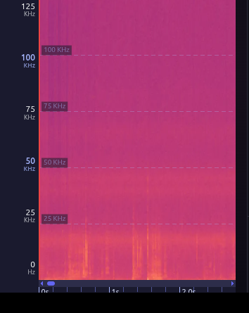

# SpectroViewer

Framework-agnostic spectrogram viewer with regions, timeline, frequency axis,
and media synchronization.

This branch (`spectrogram-v2-ratpenats`) is the Ratpenats fork. Instead of
pre-rendered image segments it renders spectrogram data tiles on `<canvas>`
from quantized spectral data delivered by the backend.



---

## Table of Contents

1. [Install](#install)
2. [Quick Start](#quick-start)
3. [Spectrogram v2 Format](#spectrogram-v2-format)
4. [API Reference](#api-reference)
   - [SpectroViewer.create(options)](#spectroviewercreateoptions)
   - [Spectrogram](#spectrogram)
   - [Media Sync](#media-sync)
   - [Playback](#playback)
   - [Zoom & Scroll](#zoom--scroll)
   - [Regions](#regions)
   - [Frequency Axis](#frequency-axis)
   - [Colormap](#colormap)
   - [Lifecycle](#lifecycle)
   - [Events](#events)
5. [Configuration Reference](#configuration-reference)
   - [TimelineConfig](#timelineconfig)
   - [FrequencyAxisConfig](#frequencyaxisconfig)
   - [FrequencyGridConfig](#frequencygridconfig)
   - [CursorConfig](#cursorconfig)
   - [HoverConfig](#hoverconfig)
   - [ScrollConfig](#scrollconfig)
   - [RegionsConfig](#regionsconfig)
   - [SpectrogramRenderConfig](#spectrogramrenderconfig)
   - [SyncMediaOptions](#syncmediaoptions)
6. [Themes](#themes)
7. [Rendering Notes](#rendering-notes)
8. [Ratpenats Integration](#ratpenats-integration)
9. [Development](#development)

---

## Install

```bash
npm install spectro-viewer
```

Ratpenats fork (this branch):

```bash
npm install https://codeload.github.com/kerojohan/SpectroViewer/tar.gz/refs/heads/spectrogram-v2-ratpenats
```

---

## Quick Start

```ts
import { SpectroViewer } from 'spectro-viewer';

// 1. Create the viewer
const viewer = SpectroViewer.create({
  container: '#viewer',
  height: 400,
  pixelsPerSecond: 100,
  theme: 'dark',
  frequencyAxis: { min: 0, max: 125000 },
});

// 2. Load spectrogram metadata
const metadata = await fetch('/api/sessions/123/spectrogram/metadata').then(r => r.json());
viewer.loadSpectrogram({ ...metadata, lazyLoad: true });

// 3. Attach an audio element
viewer.syncMedia(document.querySelector('audio')!);

// 4. Annotate detections
viewer.addRegion({
  id: 'det-1',
  start: 5.2,
  end: 5.8,
  color: 'rgba(239, 68, 68, 0.15)',
  draggable: true,
  resizable: true,
});
```

### Playing a clipped audio fragment (temporal offset)

When the audio element contains a clip extracted from a longer session, use
`offsetSec` to align the clip with the absolute spectrogram timeline:

```ts
// Audio file covers only seconds 12.3 – 14.8 of the session.
// The spectrogram shows the whole session.
viewer.syncMedia(audioEl, { offsetSec: detection.start_time });
```

The viewer will:
- move the cursor at the correct absolute position while the clip plays
- seek the clip correctly when the user clicks anywhere on the timeline
- clamp seek requests that fall outside the clip's range

See [SyncMediaOptions](#syncmediaoptions) for the full reference.

---

## Spectrogram v2 Format

`loadSpectrogram()` expects an object that conforms to `SpectrogramData`:

```jsonc
{
  "format": "spectrogram-v2",
  "version": 2,
  "sampleRate": 250000,       // audio sample rate in Hz
  "fftSize": 4096,            // FFT window size
  "hopLength": 128,           // samples between consecutive frames
  "freqMin": 0,               // lowest frequency displayed (Hz)
  "freqMax": 125000,          // highest frequency displayed (Hz)
  "bins": 1024,               // frequency bins per frame
  "dbMin": -110.0,            // dB value mapped to 0
  "dbMax": -20.0,             // dB value mapped to 255
  "tileDuration": 5.0,        // seconds covered by each tile
  "totalDuration": 60.0,      // total session duration in seconds
  "tileFormat": {
    "encoding": "raw",        // "raw" | "zstd" (zstd not yet decoded client-side)
    "dtype": "uint8",
    "layout": "time-major",   // rows = time frames, columns = frequency bins
    "endianness": "little"
  },
  "tiles": [
    {
      "file": "/api/sessions/123/spectrogram/tile/tiles/tile_000000.bin",
      "startTime": 0.0,
      "endTime": 5.0,
      "duration": 5.0,
      "frames": 2048,
      "bins": 1024
    }
    // ...one object per tile
  ],
  // optional
  "colormap": "magma",
  "lazyLoad": true,
  "lazyMargin": 300
}
```

**Tile contract**

| Property | Requirement |
|----------|-------------|
| Format | Raw `Uint8Array` (no compression in current client) |
| Size | Exactly `frames × bins` bytes |
| Layout | Time-major (row = frame, column = frequency bin) |
| Values | Pre-normalized to `0–255` |

---

## API Reference

### `SpectroViewer.create(options)`

Factory method. Returns a fully initialized `SpectroViewer` instance.

```ts
const viewer = SpectroViewer.create(options: SpectroViewerOptions);
```

| Option | Type | Default | Description |
|--------|------|---------|-------------|
| `container` | `string \| HTMLElement` | required | CSS selector or DOM element |
| `height` | `number` | `400` | Spectrogram area height in pixels |
| `pixelsPerSecond` | `number` | `100` | Initial zoom level |
| `duration` | `number` | – | Explicit total duration in seconds (overrides metadata) |
| `theme` | `'dark' \| 'light' \| ThemeColors` | `'dark'` | Color theme |
| `timeline` | `TimelineConfig \| false` | `{}` | Timeline bar below the spectrogram |
| `frequencyAxis` | `FrequencyAxisConfig \| false` | `{}` | Frequency labels on the left |
| `frequencyGrid` | `FrequencyGridConfig \| false` | `{}` | Horizontal grid lines |
| `cursor` | `CursorConfig \| false` | `{}` | Vertical playhead |
| `hover` | `HoverConfig \| false` | `{}` | Hover crosshair and time label |
| `scroll` | `ScrollConfig` | `{}` | Auto-scroll behavior during playback |
| `regions` | `RegionsConfig \| false` | `{}` | Annotation regions |
| `spectrogram` | `SpectrogramRenderConfig` | `{}` | Tile rendering options |

---

### Spectrogram

#### `loadSpectrogram(data: SpectrogramData): void`

Load spectrogram v2 metadata and initialize tile rendering. Fires `'ready'`
when done.

```ts
viewer.loadSpectrogram(metadata);
```

#### `loadSpectrogramData(data: SpectrogramData): void`

Alias for `loadSpectrogram`.

---

### Media Sync

#### `syncMedia(media: HTMLMediaElement, opts?: SyncMediaOptions): void`

Attach an `<audio>` or `<video>` element. The viewer cursor follows playback,
and clicking the spectrogram seeks the element.

```ts
// Full-session audio: no offset needed
viewer.syncMedia(audioEl);

// Clipped audio: starts at second 12.3 of the session
viewer.syncMedia(audioEl, { offsetSec: 12.3 });
```

When `offsetSec` is set, all time values exposed to the viewer
(`timeupdate`, `currentTime`, click-to-seek) are in **absolute session time**.
The adapter converts to/from the media element's local `0`-based time
internally — no external translation required.

See [SyncMediaOptions](#syncmediaoptions) for the full option reference.

---

### Playback

| Method / Getter | Description |
|-----------------|-------------|
| `play()` | Start playback |
| `pause()` | Pause playback |
| `playPause()` | Toggle play/pause |
| `setTime(seconds)` | Seek to an absolute time |
| `setPlaybackRate(rate)` | Set playback speed (e.g. `0.5`, `2`) |
| `currentTime` | Current playhead position in seconds (read-only) |
| `duration` | Total duration in seconds (read-only) |
| `isPlaying` | `true` while playing (read-only) |

---

### Zoom & Scroll

| Method | Description |
|--------|-------------|
| `zoom(pixelsPerSecond)` | Set zoom level |
| `getZoom()` | Get current pixels-per-second value |
| `setHeight(px)` | Resize the spectrogram area at runtime |
| `getHeight()` | Get current height in pixels |
| `scrollToTime(time, opts?)` | Scroll the viewport to a time position |
| `setAutoScroll(enabled)` | Enable/disable cursor-following during playback |
| `setAutoCenter(enabled)` | Enable/disable smooth cursor centering |

#### `scrollToTime` options

| Option | Type | Default | Description |
|--------|------|---------|-------------|
| `center` | `boolean` | `true` | Center the time in the viewport |
| `smooth` | `boolean` | `true` | Use smooth scrolling animation |

---

### Regions

Regions are time-range annotations drawn over the spectrogram.

#### `addRegion(options: RegionOptions): Region`

```ts
const region = viewer.addRegion({
  id: 'bat-call-1',
  start: 5.2,
  end: 5.8,
  color: 'rgba(239, 68, 68, 0.15)',
  selectedColor: 'rgba(239, 68, 68, 0.35)',
  draggable: true,
  resizable: true,
  data: { species: 'Pipistrellus pipistrellus' },
  content: '<span class="label">Ppip</span>',
});
```

| Option | Type | Default | Description |
|--------|------|---------|-------------|
| `id` | `string` | required | Unique identifier |
| `start` | `number` | required | Start time in seconds |
| `end` | `number` | required | End time in seconds |
| `color` | `string` | theme default | Fill/border color |
| `selectedColor` | `string` | theme default | Color when selected |
| `draggable` | `boolean` | `false` | Allow moving by dragging |
| `resizable` | `boolean` | `false` | Allow resizing by dragging edges |
| `minLength` | `number` | `0.01` | Minimum duration in seconds |
| `data` | `Record<string, unknown>` | – | Arbitrary metadata |
| `content` | `string \| HTMLElement` | – | HTML rendered inside the region |

#### Returned `Region` object

| Member | Description |
|--------|-------------|
| `id`, `start`, `end`, `color`, … | All `RegionOptions` fields |
| `selected` | Whether this region is currently selected |
| `remove()` | Remove from the viewer |
| `setOptions(partial)` | Update any option |
| `setContent(html)` | Replace the inner content |

#### Other region methods

| Method | Description |
|--------|-------------|
| `removeRegion(id)` | Remove a region by id |
| `clearRegions()` | Remove all regions |
| `getRegion(id)` | Find a region by id |
| `getRegions()` | Return all regions |
| `selectRegion(id \| null)` | Select or deselect a region |
| `getSelectedRegion()` | Return the currently selected region or `null` |
| `enableDragSelection()` | Let users create regions by dragging on the spectrogram |
| `disableDragSelection()` | Disable drag-to-create |

---

### Frequency Axis

#### `updateFrequencyAxis(config: Partial<FrequencyAxisConfig>): void`

Update frequency axis options at runtime.

```ts
viewer.updateFrequencyAxis({ min: 0, max: 80000, labelCount: 8 });
```

---

### Colormap

#### `setColormap(colormap: SpectrogramColorMap): void`

Switch the color palette at runtime. Available values:

| Value | Description |
|-------|-------------|
| `'magma'` | Perceptually uniform, black → purple → yellow |
| `'inferno'` | Similar to magma, slightly more red |
| `'viridis'` | Blue → green → yellow |
| `'plasma'` | Purple → pink → yellow |
| `'turbo'` | Full rainbow, high contrast |
| `'gray'` | Black and white |
| `'gray-inverse'` | White and black |
| `'chiroptera'` | Warm dark navy, tuned for bat call recordings |

---

### Lifecycle

#### `destroy(): void`

Detach all event listeners, cancel pending fetch requests, remove the DOM
tree, and emit `'destroy'`.

```ts
viewer.destroy();
```

---

### Events

Subscribe with `viewer.on(event, handler)` and unsubscribe with
`viewer.off(event, handler)`.

| Event | Payload | Fired when |
|-------|---------|------------|
| `ready` | – | Spectrogram metadata has been loaded |
| `timeupdate` | `time: number` | Playhead position changed (every animation frame during playback) |
| `play` | – | Playback started |
| `pause` | – | Playback paused |
| `finish` | – | Playback reached the end |
| `zoom` | `pixelsPerSecond: number` | Zoom level changed |
| `scroll` | `scrollLeft: number` | Viewport scrolled |
| `region:created` | `region: Region` | A region was added |
| `region:updated` | `region: Region` | A region was moved or resized |
| `region:removed` | `region: Region` | A region was deleted |
| `region:clicked` | `region: Region, event: MouseEvent` | A region was clicked |
| `region:selected` | `region: Region \| null` | Selection changed |
| `region:drag-start` | `region: Region` | Drag/resize started |
| `region:drag-end` | `region: Region` | Drag/resize ended |
| `destroy` | – | `destroy()` was called |

```ts
viewer.on('timeupdate', (time) => {
  console.log('current time:', time);
});

viewer.on('region:clicked', (region, e) => {
  console.log('clicked region:', region.id, region.data);
});
```

---

## Configuration Reference

### `TimelineConfig`

Options for the time axis rendered below the spectrogram.

| Option | Type | Default | Description |
|--------|------|---------|-------------|
| `height` | `number` | `24` | Height of the timeline bar in pixels |
| `primaryColor` | `string` | theme | Color of major tick marks |
| `secondaryColor` | `string` | theme | Color of minor tick marks |
| `fontColor` | `string` | theme | Label text color |
| `fontSize` | `number` | `11` | Label font size in pixels |
| `fontFamily` | `string` | `system-ui` | Label font family |

---

### `FrequencyAxisConfig`

Options for the frequency labels on the left side.

| Option | Type | Default | Description |
|--------|------|---------|-------------|
| `min` | `number` | `0` | Minimum frequency in Hz |
| `max` | `number` | from metadata | Maximum frequency in Hz |
| `labels` | `'auto' \| number[]` | `'auto'` | `'auto'` generates evenly spaced labels; pass an array for explicit values |
| `labelCount` | `number` | `6` | Number of labels when using `'auto'` |
| `width` | `number` | `55` | Panel width in pixels |
| `formatLabel` | `(hz: number) => string` | built-in | Custom label formatter |

---

### `FrequencyGridConfig`

Options for the horizontal guide lines drawn over the spectrogram.

| Option | Type | Default | Description |
|--------|------|---------|-------------|
| `lines` | `'auto' \| number[]` | `'auto'` | Hz values to draw lines at; `'auto'` derives from the frequency axis |
| `color` | `string` | theme | Line color |
| `opacity` | `number` | `0.35` | Line opacity `0–1` |
| `lineWidth` | `number` | `1` | Line width in CSS pixels |
| `dashPattern` | `[number, number] \| null` | `[4, 4]` | Dash pattern `[dash, gap]`; `null` for solid |
| `showLabels` | `boolean` | `true` | Show Hz labels next to lines |
| `formatLabel` | `(hz: number) => string` | built-in | Custom label formatter |
| `highlightBands` | `FrequencyBandHighlight[]` | `[]` | Tinted overlays for frequency bands of interest |

#### `FrequencyBandHighlight`

| Option | Type | Default | Description |
|--------|------|---------|-------------|
| `minHz` | `number` | required | Lower bound in Hz |
| `maxHz` | `number` | required | Upper bound in Hz |
| `fillColor` | `string` | `'rgba(255,200,40,0.07)'` | Band fill color |
| `borderColor` | `string` | `'rgba(255,200,40,0.6)'` | Border line color |
| `borderWidth` | `number` | `1.5` | Border width in pixels |
| `label` | `string` | – | Optional text label inside the band |
| `labelColor` | `string` | matches `borderColor` | Label text color |

---

### `CursorConfig`

Options for the vertical playhead line.

| Option | Type | Default | Description |
|--------|------|---------|-------------|
| `color` | `string` | theme | Line color |
| `width` | `number` | `2` | Line width in pixels |

---

### `HoverConfig`

Options for the crosshair and label shown while hovering over the spectrogram.

| Option | Type | Default | Description |
|--------|------|---------|-------------|
| `enabled` | `boolean` | `true` | Show/hide the hover line |
| `color` | `string` | theme | Line color |
| `labelBackground` | `string` | theme | Time label background color |
| `labelColor` | `string` | theme | Time label text color |
| `showTime` | `boolean` | `true` | Show the time label |
| `formatTime` | `(seconds: number) => string` | built-in | Custom time formatter |

---

### `ScrollConfig`

Options for viewport scroll behavior during playback.

| Option | Type | Default | Description |
|--------|------|---------|-------------|
| `autoScroll` | `boolean` | `true` | Keep the cursor visible by scrolling when it reaches the right margin |
| `autoCenter` | `boolean` | `true` | Smoothly lerp the cursor toward the center of the viewport |

---

### `RegionsConfig`

Default options applied to regions created via `addRegion` or drag-selection.

| Option | Type | Default | Description |
|--------|------|---------|-------------|
| `color` | `string` | theme | Default region color |
| `selectedColor` | `string` | theme | Default selected color |
| `draggable` | `boolean` | `false` | Make all regions draggable by default |
| `resizable` | `boolean` | `false` | Make all regions resizable by default |
| `dragSelection` | `boolean` | `false` | Enable drag-to-create on startup |
| `dragSelectionColor` | `string` | theme | Preview color while dragging |
| `minLength` | `number` | `0.01` | Minimum region duration in seconds |

---

### `SpectrogramRenderConfig`

Options that control how tiles are decoded and rendered.

| Option | Type | Default | Description |
|--------|------|---------|-------------|
| `colormap` | `SpectrogramColorMap` | `'magma'` | Initial color palette |
| `prefetchMargin` | `number` | `300` | Extra pixels rendered beyond the viewport edge during scroll or seek |
| `frequencyEmphasis` | `FrequencyEmphasis` | – | Boost signal intensity in a target frequency range |

#### `FrequencyEmphasis`

Applies per-bin gamma correction and an intensity boost to a specific
frequency band, making faint signals more visible without changing the rest
of the colormap.

| Option | Type | Default | Description |
|--------|------|---------|-------------|
| `minHz` | `number` | required | Lower bound of the target band in Hz |
| `maxHz` | `number` | required | Upper bound of the target band in Hz |
| `boost` | `number` | `1.5` | Intensity multiplier applied after gamma |
| `gamma` | `number` | `1.0` | Exponent applied before boost; values `< 1` (e.g. `0.6`) reveal subtle signals |
| `dataMinHz` | `number` | `0` | Minimum frequency of the tile data |
| `dataMaxHz` | `number` | `125000` | Maximum frequency of the tile data |

```ts
SpectroViewer.create({
  container: '#viewer',
  spectrogram: {
    colormap: 'chiroptera',
    frequencyEmphasis: {
      minHz: 20000,
      maxHz: 80000,
      gamma: 0.6,
      boost: 1.8,
    },
  },
});
```

---

### `SyncMediaOptions`

Options for `syncMedia(media, opts)`.

| Option | Type | Default | Description |
|--------|------|---------|-------------|
| `offsetSec` | `number` | `0` | Seconds to add to the media element's local time to obtain the absolute position on the spectrogram timeline |

#### When to use `offsetSec`

The spectrogram is always rendered in **absolute session time** (e.g. 0–120 s
for a two-minute recording session).  An audio element attached with
`syncMedia` often covers the **entire** session, so no offset is needed.

However, when the audio file is a **clip** extracted from a longer session
(e.g. a 2.5 s detection fragment starting at second 12.3), the media
element's `currentTime` runs from `0` to `2.5` while the spectrogram expects
a position between `12.3` and `14.8`.

Setting `offsetSec: 12.3` lets the viewer handle this automatically:

```ts
viewer.syncMedia(audioEl, { offsetSec: detection.start_time });
```

Internally, the adapter applies the translation in both directions:

| Operation | Formula |
|-----------|---------|
| Media → viewer (cursor position) | `absoluteTime = media.currentTime + offsetSec` |
| Viewer → media (click-to-seek) | `media.currentTime = absoluteTime − offsetSec` |

Seek requests that fall outside the clip's `[0, duration]` range are clamped
automatically. The rest of the viewer API (`currentTime`, `timeupdate` events,
`setTime()`) always uses absolute time.

#### Example: detection fragment playback

```ts
const detection = {
  id: 'det-42',
  start_time: 12.3,   // absolute seconds in the session
  end_time: 14.8,
};

// Highlight the detection
viewer.addRegion({
  id: detection.id,
  start: detection.start_time,
  end: detection.end_time,
  color: 'rgba(239, 68, 68, 0.15)',
});

// Scroll the viewport to the detection
viewer.scrollToTime(detection.start_time, { center: true });

// Wire a clipped audio file to the absolute timeline
const audio = new Audio(`/api/detections/${detection.id}/audio`);
viewer.syncMedia(audio, { offsetSec: detection.start_time });
```

---

## Themes

Two built-in themes are provided:

```ts
import { DARK_THEME, LIGHT_THEME, resolveTheme } from 'spectro-viewer';

const viewer = SpectroViewer.create({ theme: 'dark' });
// or
const viewer = SpectroViewer.create({ theme: 'light' });
```

Pass a `ThemeColors` object to fully customize:

```ts
SpectroViewer.create({
  theme: {
    background: '#0a0a0a',
    text: '#e5e5e5',
    cursorColor: '#f97316',
    // … all ThemeColors fields
  },
});
```

---

## Rendering Notes

The tile rendering pipeline:

1. Tiles are fetched lazily via `IntersectionObserver` as they scroll into view.
2. Raw `Uint8Array` values are read from the `ArrayBuffer` response.
3. A 256-entry color lookup table (LUT) maps each byte to an RGBA value.
4. Optional frequency emphasis applies gamma correction and a per-bin boost
   before the LUT step.
5. The result is written to a `<canvas>` element via `putImageData`.

**Current limitations:**

- Tile encoding must be `"raw"` (`uint8`). Client-side `zstd` decompression
  is not yet implemented.
- Each tile is rendered at the resolution visible in the viewport (max-pooling
  downsampling). Sub-pixel detail at very low zoom may be lost.

---

## Ratpenats Integration

Expected backend endpoints:

| Endpoint | Description |
|----------|-------------|
| `GET /api/sessions/{id}/spectrogram/metadata` | Returns `SpectrogramData` JSON |
| `GET /api/sessions/{id}/spectrogram/tile/{filename}` | Returns a raw tile `Uint8Array` |

Expected file on disk:

- `spectroviewer/metadata.v2.json`

---

## Development

```bash
npm install
npm run build   # TypeScript + Vite bundle
npm test        # Unit tests (vitest)
```
